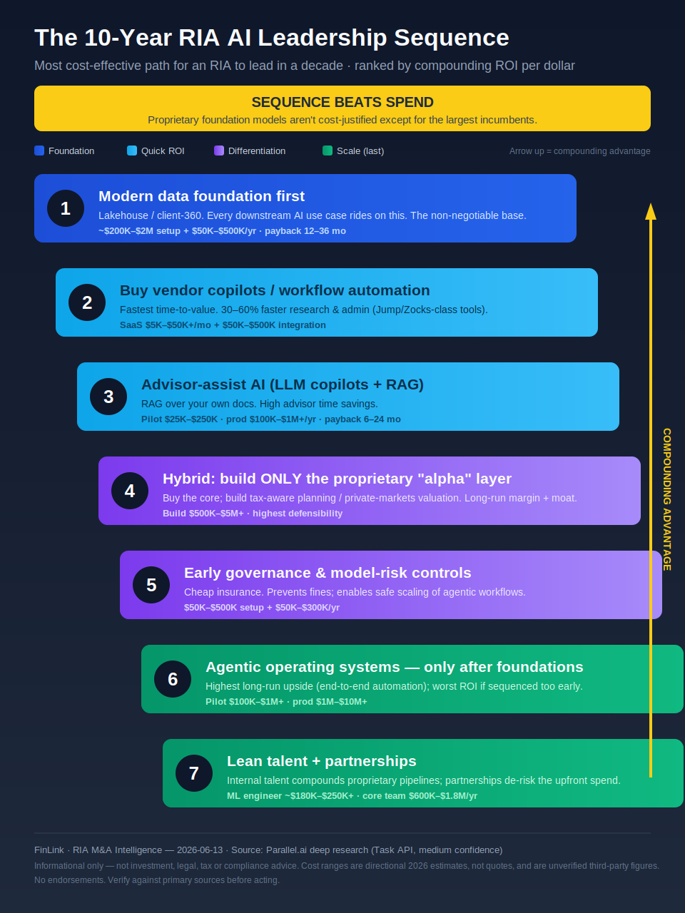

# The 10-Year RIA AI Leadership Sequence

> [!tip] One message
> **Sequence beats spend.** Build the data foundation, buy for quick ROI, then build *only* the proprietary "alpha" layer, govern early, and deploy autonomous agents **last**. Proprietary foundation models aren't cost-justified except for the largest incumbents.

## Infographic
*(Obsidian renders the SVG inline. Keep the `.svg` in the same folder as this note.)*

![[ria-ai-10yr-sequence-infographic.svg]]

<!-- Portable fallback (works outside Obsidian, e.g. GitHub/Substack preview): -->

## The seven steps (text mirror, for search/accessibility)

| # | Step | Phase | Cost signal | Payback / why |
|---|------|-------|-------------|----------------|
| 1 | Modern **data foundation** first (lakehouse / client-360) | Foundation | ~$200K–$2M + $50K–$500K/yr | 12–36 mo; everything rides on it |
| 2 | **Buy** vendor copilots / workflow automation | Quick ROI | SaaS $5K–$50K+/mo + $50K–$500K integ. | Fastest time-to-value; 30–60% faster admin |
| 3 | **Advisor-assist AI** (LLM copilots + RAG on your docs) | Quick ROI | Pilot $25K–$250K · prod $100K–$1M+/yr | 6–24 mo; high advisor time savings |
| 4 | **Hybrid** — build only the proprietary "alpha" layer | Differentiation | Build $500K–$5M+ | Long-run margin + moat |
| 5 | Early **governance** & model-risk controls | Differentiation | $50K–$500K + $50K–$300K/yr | Cheap insurance; enables safe scaling |
| 6 | **Agentic OS** — only after foundations are solid | Scale (last) | Pilot $100K–$1M+ · prod $1M–$10M+ | Highest upside; worst ROI if too early |
| 7 | **Lean talent + partnerships** | Scale | ML eng ~$180K–$250K+ · team $600K–$1.8M/yr | Compounds proprietary pipelines |

## To export for Substack / slides
Open the `.svg` in a browser and "Save as PNG", or: `rsvg-convert -w 1440 ria-ai-10yr-sequence-infographic.svg -o ria-ai-10yr-sequence.png` (or `cairosvg`). SVG keeps it crisp at any size.

> [!warning] Disclosures
> Informational only — not investment, legal, tax, or compliance advice; no endorsements. Cost/ROI ranges are directional 2026 estimates (not quotes), reproduced from Parallel.ai deep research and **not independently verified** (medium confidence). Verify against primary sources before acting. As of 2026-06-13.
