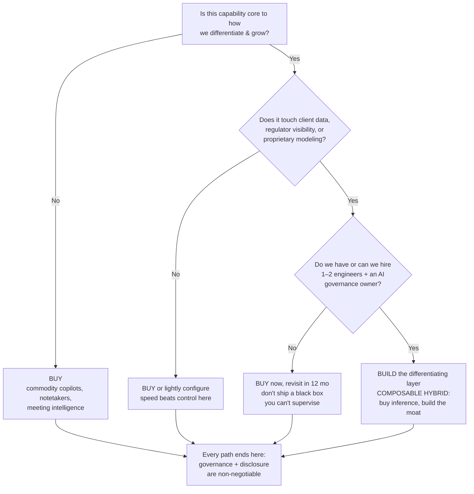

> [!info] How this was made
> Every number and quote below was gathered through an automated research workflow that runs **six structured queries against the Parallel.ai Search API**, then dedupes and numbers each source. Citations in `[n]` brackets map to the **Sources** list at the bottom — which maps, in turn, to the machine-generated `sources_latest.json` in the workflow folder. Nothing here is from memory; it's from the corpus. Read the disclosures at the end before you forward this to your investment committee.

# The AI decision that will quietly decide which RIAs survive

There's a number that should be keeping every RIA principal up at night, and it isn't a market level.

It's **63%**.

That's the share of independent RIAs now using AI in some capacity — a figure that has **more than doubled since 2023**, according to a Schwab Advisor Services study of 533 firms conducted in October 2025. [^2][^9] Sounds like good news. Here's the part that should make your stomach drop: only about **one in ten** of those firms has actually woven AI into their business strategy. [^2][^9] The rest are using it the way a teenager uses a Ferrari to drive to the mailbox — for notetaking and email drafts.

> [!quote]
> "AI is here, and adoption matters. Firms that set a clear vision and invest in upskilling their talent and building strong data foundations will be better positioned to turn AI from a curiosity into a huge competitive advantage."
> — Lisa Salvi, Head of Business Consulting & Education, Schwab Advisor Services [^8]

Translation for the corner office: **the gap between "we have AI" and "AI runs our firm" is the gap that's about to separate the acquirers from the acquired.** And the single decision that determines which side you land on is the oldest question in technology, now with the highest stakes it has ever carried for wealth management.

Do you **build**, or do you **buy**?

---

## First, the clock you're racing

Zoom out and the pressure gets worse. The 2026 Global AI in Financial Services Report from the Cambridge Judge Business School found **81% of financial-services firms are adopting AI at some level**, with **40% already at "Scaling" or "Transforming" maturity** — and crucially, **agentic AI is already in active adoption at 52% of industry respondents.** [^3] The Federal Reserve, separately, pegged work-related generative-AI usage at roughly **41% of the U.S. workforce** as of late 2025. [^1]

This is not a "wait and see" curve. It's a "wait and lose" curve.

```chartjs
{
  "type": "bar",
  "data": {
    "labels": ["RIAs using AI\n(Schwab)", "RIAs with AI in\ncore strategy", "FS firms adopting\nAI (Cambridge)", "FS firms at advanced\nmaturity (Cambridge)", "Agentic AI active\nadoption (Cambridge)"],
    "datasets": [{
      "label": "% of firms",
      "data": [63, 10, 81, 40, 52],
      "backgroundColor": ["#2563eb", "#93c5fd", "#7c3aed", "#c4b5fd", "#0ea5e9"]
    }]
  },
  "options": {
    "plugins": {
      "title": { "display": true, "text": "The adoption gap: everyone has AI, almost no one has integrated it (2025–26)" },
      "legend": { "display": false }
    },
    "scales": { "y": { "beginAtZero": true, "max": 100, "title": { "display": true, "text": "% of firms" } } }
  }
}
```
<small>Sources: Schwab/Logica [^2][^9]; Cambridge Judge Business School [^3].</small>

> [!warning] The FOMO is mathematically justified
> If 90% of AI-using firms are stuck at "notetaker," the firm in your market that crosses into *integrated* AI isn't 10% better. It's operating a different business model. One wealthtech panel put it bluntly: AI lets a team "serve twice as many households without doubling payroll." [^11] That's not a productivity tweak. That's a margin structure your competitors can't match — and your best advisors will notice.

---

## The fork in the road

Here's where it splits, and why smart people disagree.

### The case for BUY (and it's strong)

The vendor ecosystem has gone from "nice-to-have" to "armed and funded." The two names every C-suite knows — Jump and Zocks — both market the same headline benefit: **10+ hours per week returned to each advisor.** [^21][^22] At Equitable Advisors, pilot participants reported saving **10 or more hours per week** during heavy client periods. [^21] Zocks says it's now used by **more than 5,000 financial firms.** [^27]

And the money is validating it. Zocks raised a **$45 million Series B in January 2026** (co-led by Lightspeed and QED), bringing lifetime funding to **$65 million**, then signed a distribution deal with Cetera's **~12,000 professionals.** [^21][^27] Its enterprise client list already includes Ameritas, Carson Group, Commonwealth, and Osaic. [^27] Meanwhile Zocks went exclusive with mega-RIA Hightower, and Jump became the "choice AI operating system" for Equitable's field force. [^26]

This isn't experimental anymore. When **Merrill and Bank of America Private Bank** launch an AI meeting solution they say can save advisors **up to four hours per meeting across millions of meetings annually**, the question stops being "is the tech real?" [^24]

> [!tip] If you're an advisor reading this and weighing a move
> A firm that has *already bought and integrated* best-in-class tools is handing you back two working days a month — time you reinvest in clients and growth. A firm still "evaluating" is asking you to absorb that drag personally. **Ask the recruiter for the actual stack, the actual integrations, and the actual hours saved.** Vague answers are an answer.

```chartjs
{
  "type": "bar",
  "data": {
    "labels": ["FinMate AI", "Zocks / Jump", "Merrill–BofA (per meeting)", "DataDasher"],
    "datasets": [{
      "label": "Hours saved per advisor / week (approx.)",
      "data": [7.5, 10, 4, 15],
      "backgroundColor": ["#64748b", "#2563eb", "#f59e0b", "#16a34a"]
    }]
  },
  "options": {
    "indexAxis": "y",
    "plugins": {
      "title": { "display": true, "text": "Vendor-reported time savings (self-reported; see disclosures)" },
      "legend": { "display": false }
    },
    "scales": { "x": { "beginAtZero": true, "title": { "display": true, "text": "Hours / week (FinMate quoted 1–2 hrs/day; Merrill figure is per-meeting)" } } }
  }
}
```
<small>Vendor/press figures, not independently verified: FinMate [^28]; Zocks/Jump [^21][^22]; Merrill–BofA [^24]; DataDasher [^25].</small>

### The case for BUILD (and why it's suddenly credible)

For a decade, "build your own advisor tech" was a punchline reserved for firms with more ego than engineers. **That changed in the last 18 months.**

Kitces notes that AI "vibe-coding" tools — Replit, Bolt, Canva Code — now let an advisor "build a workable software prototype in an afternoon," collapsing the cost of creating viable software. [^17] And a widely-read 2026 wealthtech forecast made a prediction that's being quoted in boardrooms:

> [!quote]
> "The fastest-growing and most profitable firms of the future will be the ones that hired one or two software engineers in 2026 and empowered them to build the infrastructure needed for an AI-enabled operating model."
> — *AI Trends Transforming Wealth Management Platforms*, WealthManagement.com [^12]

The build thesis isn't really about saving software fees. It's about a **moat**. Off-the-shelf tools give you parity; everyone who writes a check gets the same capability. Proprietary infrastructure gives you something competitors literally cannot buy — and, increasingly, something **advisors want to join.** As OneVest frames it, technology has become "a recruiting asset, not just an operational one"; firms with modern, integrated infrastructure "are winning deals that firms with legacy infrastructure are losing." [^19]

---

## The number that ends most build fantasies

Then the CFO walks in with a spreadsheet.

Building custom wealth-management software runs **$40,000 to $600,000+** up front — and one detailed 2026 breakdown puts enterprise-grade custom platforms at **$150,000 to $1.5 million+**, depending on integrations, security, and compliance scope. [^34][^39] Buying isn't free either (implementation fees run **$50,000–$500,000**), but the timelines diverge violently: **3–6 months to deploy a platform vs. 12–36 months to build one**, plus ongoing maintenance of **15–20% of development cost every year, forever.** [^34]

And the kicker every executive underestimates: **70% of software projects exceed their initial budgets, by an average of 27%.** [^32]

| Factor | Build (custom) | Buy (off-the-shelf) |
|---|---|---|
| Initial cost | $40K–$600K+ (up to $1.5M+ enterprise) [^34][^39] | $50K–$500K implementation [^34] |
| Time to launch | 12–36 months [^34] | 3–6 months [^34] |
| Ongoing maintenance | 15–20% of dev cost / yr (yours) [^34] | Vendor-managed [^34] |
| Differentiation | High — competitors can't replicate [^34] | Low — rivals run the same system [^34] |
| Vendor lock-in | Low (you own the code) [^34] | High [^34] |
| Budget-overrun risk | 70% of projects, avg +27% [^32] | Shifted to vendor |

> [!info] Where the smart money is actually landing: hybrid
> The emerging 2026 consensus isn't pure build *or* pure buy. A build-vs-buy framework for financial-services AI argues that for most mid-market firms the right answer is **"composable hybrid": buy the inference layer, buy or open-source the orchestration, and build everything that touches customer data, regulator visibility, or proprietary modeling.** [^20] One sobering technical footnote for anyone budgeting an in-house agent: production agent workloads can consume **4–8x the tokens** of a simple chatbot — so the bill scales fast. [^20]

---

## The landmine nobody puts in the pitch deck

Whatever you decide, the SEC has already decided to watch.

> [!danger] AI-washing is now an enforcement category, not a buzzword
> The SEC has **already charged investment advisers for false or misleading statements about their use of AI** — "AI-washing" — finding violations of the Marketing Rule (Rule 206(4)-1). [^41][^45] In December 2025 the SEC issued a Marketing Rule risk alert flagging missing disclosures and a gap between what firms' policies *say* and what they actually *do.* [^41] The 2025 Exam Priorities confirm examiners will closely assess advisers' AI-related policies, procedures, and disclosures. [^45]

This cuts both ways on the build/buy decision:

- **If you buy:** you inherit vendor risk. Compliance experts now insist firms maintain a **living inventory of every AI tool — including third-party systems that process meeting notes or emails** — and assess how vendors and sub-advisers use AI. [^41][^48] Amended **Regulation S-P** expands your obligations to protect client data and notify clients of breaches; that applies squarely to AI systems handling personal data. [^43]
- **If you build:** you own the "black box" problem. If your RIA "cannot explain how an algorithm produces recommendations, it may be unable to demonstrate compliance with fiduciary duties." [^43] And any AI-assisted process touching regulated activity or client communications should **retain a human review component** — documented, not theoretical. [^48]

The uncomfortable truth: **buying outsources the build, but not the liability.** The fiduciary duty is yours either way.

---

## Why your AI strategy is really an enterprise-value strategy

Here's the part that turns an ops conversation into a C-suite obsession.

RIA valuations remain rich — an industry average around **10x EBITDA**, with firms under $500M AUM at **8–11x**, $500M–$3B at **10–15x**, $3B–$20B reaching the **high teens**, and the largest platforms in the **low 20s+**; PE-backed "meta-RIAs" pay the top of the range. [^60] With private equity involved in an estimated **70–79% of RIA transactions**, the buyers setting these prices are sophisticated, and they've changed what they're paying *for.* [^52]

> [!quote]
> "If everyone is getting bigger, size alone becomes less distinguishing. In a market where AUM can be acquired, recruited, or inflated by market appreciation, the scarcer asset is not scale. It is organic growth."
> — Mercer Capital, *Organic Growth Is the New Scarcity Premium* [^54]

And organic growth has, for the first time in years, **surpassed M&A as the top priority** for a majority of advisory firms (per Cerulli, cited by Mercer). [^54] Mercer's own math is stark: a firm growing **~12% organically could command an EBITDA multiple more than double** that of a firm with no organic growth. [^57] What do buyers now underwrite as evidence of durable organic growth? Mercer's Q1 2026 list names it directly: consistent organic growth, a deep leadership bench, and **"institutional infrastructure, including technology, compliance, and repeatable processes."** [^51]

Connect the dots: **your AI operating model is no longer a cost line. It is a multiple expander.** The firm that integrates AI to drive repeatable organic growth doesn't just run leaner — it sells for more, recruits better, and compounds the advantage. The firm that waits watches its multiple, and its best advisors, drift to the firm that didn't.

```chartjs
{
  "type": "bar",
  "data": {
    "labels": ["< $500M AUM", "$500M–$3B", "$3B–$20B", "> $20B / PE meta-RIA"],
    "datasets": [{
      "label": "EV / EBITDA multiple (low)",
      "data": [8, 10, 16, 20],
      "backgroundColor": "#1d4ed8"
    }, {
      "label": "EV / EBITDA multiple (high)",
      "data": [11, 15, 19, 24],
      "backgroundColor": "#60a5fa"
    }]
  },
  "options": {
    "plugins": {
      "title": { "display": true, "text": "RIA EV/EBITDA multiples climb with scale — and scale increasingly requires a tech operating model" }
    },
    "scales": { "y": { "beginAtZero": true, "title": { "display": true, "text": "EV / EBITDA (x)" } } }
  }
}
```
<small>Source: Family Wealth Report / Advisor Growth Strategies & DeVoe ranges [^60]; PE deal-share and scale context [^52]. Ranges are illustrative, not appraisals — see disclosures.</small>

---

## A decision framework you can take to your next leadership meeting



> [!tip] For advisors evaluating which RIA to join — five questions that cut through the pitch
> 1. **"Show me the stack."** Which AI tools are *integrated* (not just licensed)? Integration is where the hours actually come back. [^11][^21]
> 2. **"What's your AI governance?"** Is there a written policy, a tool inventory, and a human-review step — or a slide? [^41][^48]
> 3. **"Build, buy, or hybrid — and why?"** A firm that can't articulate its thesis probably doesn't have one. [^20]
> 4. **"What's your organic growth rate?"** It's the metric buyers — and your future equity — care most about. [^54][^57]
> 5. **"How do you handle client data with these tools?"** Reg S-P and fiduciary duty don't care whose logo is on the software. [^43]

---

## The bottom line

The build-vs-buy debate sounds like an IT procurement question. It isn't. It's a **referendum on whether your firm will be a buyer or a target** in the consolidation wave already underway. The data is consistent and uncomfortable: adoption is near-universal but integration is rare [^2][^3], the tools are funded and proven [^21][^24][^27], the economics punish naïve building [^32][^34] but reward defensible differentiation [^19][^20], the regulator is watching the claims you make [^41][^45], and the buyers writing 10–20x checks are now paying for exactly the kind of repeatable, tech-enabled organic growth that an integrated AI operating model produces. [^51][^54][^57]

You don't have to build everything. You can't safely buy your way out of accountability. But you cannot afford to be the firm still "exploring" while the firm across town is **operating a structurally cheaper, faster-growing, higher-multiple business.**

The clock that started at 63% is still running. ⏳

---

> [!warning]+ Important Disclosures — read before sharing
> **Not advice.** This briefing is for informational and educational purposes only. It is **not investment, legal, tax, accounting, or compliance advice**, and is not a recommendation, solicitation, or offer to buy or sell any security or to adopt any strategy, product, or vendor. Consult your own qualified professionals — including legal counsel and your Chief Compliance Officer — before acting on anything here.
>
> **No endorsements.** Companies, platforms, and firms named above (e.g., Schwab, Zocks, Jump, Cetera, Hightower, Equitable, Merrill, Bank of America, FinMate, DataDasher, Mercer Capital, and others) are referenced solely as illustrations drawn from publicly available third-party sources. Their mention is **not an endorsement, recommendation, or evaluation**, and implies no affiliation with or sponsorship of this publication.
>
> **Third-party data; accuracy not guaranteed.** Statistics, quotes, vendor performance claims (including all "hours saved" figures), funding amounts, valuation multiples, and adoption rates are reproduced from the cited third-party sources and **have not been independently verified**. Vendor-reported metrics are inherently self-interested and may not reflect typical results. Figures are current only as of the cited sources' publication and **as of this briefing's date (2026-06-02)**; they may since have changed.
>
> **Valuation ranges are illustrative.** EBITDA multiples and growth figures are general market commentary, **not an appraisal** of any specific firm. Actual transaction values depend on facts and circumstances. Past results and historical multiples do not predict future outcomes.
>
> **Forward-looking statements.** Statements about the future of AI, wealth management, valuations, or competition are opinions and projections subject to significant uncertainty. No outcome is guaranteed.
>
> **AI-assisted research.** This briefing was produced with an AI-assisted research workflow (Parallel.ai Search API) and human editorial review. Sources are linked so readers can verify primary material directly. Any error is unintentional; corrections welcome.
>
> **Regulatory note for advisers.** If you are an SEC- or state-registered investment adviser, remember that any republication, marketing use, or client-facing adaptation of this content may implicate the SEC Marketing Rule (Rule 206(4)-1), recordkeeping rules, and your firm's AI and advertising policies. Review accordingly. The phrase "registered investment adviser" does not imply a certain level of skill or training.

---

## Sources

[^1]: [The Fed — Monitoring AI Adoption in the U.S. Economy](https://www.federalreserve.gov/econres/notes/feds-notes/monitoring-ai-adoption-in-the-u-s-economy-20260403.html) (Federal Reserve, 2026)
[^2]: [Schwab Study Reveals RIA AI Adoption More Than Doubles — But Most Firms Still in Early Stages](https://pressroom.aboutschwab.com/press-releases/press-release/2026/Schwab-Study-Reveals-RIA-AI-Adoption-More-Than-Doubles---But-Most-Firms-Still-in-Early-Stages/default.aspx) (Charles Schwab)
[^3]: [2026 Global AI in Financial Services Report — Adoption, Impact and Risks](https://www.jbs.cam.ac.uk/faculty-research/centres/alternative-finance/publications/2026-global-ai-in-financial-services-report/) (Cambridge Judge Business School, May 2026)
[^8]: [RIA AI Adoption Doubles as Advisors Cut Admin Work](https://401kspecialistmag.com/ai-adoption-doubles-since-2023) (401(k) Specialist, Jan 2026)
[^9]: [Independent RIA AI use soars, but most firms still at the start of the journey](https://www.investmentnews.com/ria-news/independent-ria-ai-use-soars-but-most-firms-still-at-the-start-of-the-journey/264944) (InvestmentNews, Jan 2026)
[^11]: [The Silent Revolution: How AI in RIA Operations Is Eating Your Tech Stack](https://wealthtechtoday.com/2025/06/30/the-silent-revolution-how-ai-in-ria-operations-is-eating-your-tech-stack/) (WealthTech Today, 2025)
[^12]: [AI Trends Transforming Wealth Management Platforms](https://www.wealthmanagement.com/artificial-intelligence/ai-trends-reshaping-wealth-management-in-2026) (WealthManagement.com, Apr 2026)
[^17]: [The Latest in Financial #AdvisorTech (June 2026)](https://www.kitces.com/blog/the-latest-in-financial-advisortech-june-2026-altruist-corporate-ria-flourish-taxstatus-risr/) (Kitces, May 2026)
[^19]: [RIA M&A Integration Challenges and How Agentic AI Solves Them](https://www.onevest.com/blog/ria-ma-integration-agentic-ai) (OneVest, May 2026)
[^20]: [Build vs Buy: AI Agent Platform for Financial Services — A Strategic Decision Framework](https://interexy.com/build-vs-buy-ai-agent-platform) (Interexy, Jun 2026)
[^21]: [Zocks, Jump expand advisor reach with new enterprise integrations](https://www.investmentnews.com/fintech/zocks-jump-expand-advisor-reach-with-new-enterprise-integrations/266805) (InvestmentNews, May 2026)
[^22]: [How AI Saves Financial Advisors 10+ Hours Per Week](https://www.zocks.io/blog/how-ai-saves-financial-advisors-10-hours-per-week) (Zocks, Apr 2026)
[^24]: [Merrill and Bank of America Private Bank Launch AI-Powered Meeting Journey](https://newsroom.bankofamerica.com/content/newsroom/press-releases/2026/03/merrill-and-bank-of-america-private-bank-launch-ai-powered-meeti.html) (Bank of America, Mar 2026)
[^25]: [DataDasher and Bento Engine Announce Strategic Partnership](http://prnewswire.com/news-releases/datadasher-and-bento-engine-announce-strategic-partnership-to-maximize-data-driven-advice-opportunities-for-financial-professionals-302573339.html) (PR Newswire, Oct 2025)
[^26]: [The AI spending boom is alive and well. This is why it matters to advisors](https://www.investmentnews.com/equities/the-ai-spending-boom-is-alive-and-well-this-is-why-it-matters-to-advisors/266801) (InvestmentNews, May 2026)
[^27]: [Zocks raises $45M in continued push for AI as an advisor growth driver](https://www.investmentnews.com/fintech/zocks-raises-45m-in-continued-push-for-ai-as-an-advisor-growth-driver/264970) (InvestmentNews, Jan 2026)
[^28]: [FinMate AI — Zoom App Marketplace](http://marketplace.zoom.us/apps/VEtTdiMORQK89fyCiQ9Hlg)
[^32]: [Why wealth management firms win by buying technology, not building it](https://www.thewealthmosaic.com/vendors/docupace/blogs/why-wealth-management-firms-win-by-buying-technolo/) (The Wealth Mosaic / Docupace)
[^34]: [A Guide to Wealth Management Software Development in 2026](https://appinventiv.com/blog/guide-to-wealth-management-software-development) (Appinventiv, Jan 2026)
[^39]: [Custom Wealth Management Software Development](https://www.scnsoft.com/investment/wealth-management) (ScienceSoft)
[^41]: [AI Compliance for Firms and RIAs in 2026](https://www.ncontracts.com/nsight-blog/investment-advisers-artificial-intelligence) (Ncontracts, Apr 2026)
[^43]: [Managing AI in Financial Services: Ensuring Compliance with AI Usage Policies in Your RIA](https://itsynergy.com/managing-ai-in-financial-services-ensuring-compliance-with-ai-usage-policies-in-your-ria) (itSynergy, Aug 2025)
[^45]: [AI Compliance Tips for Investment Advisers](https://www.mofo.com/resources/insights/251015-ai-compliance-tips-for-advisers) (Morrison Foerster, Oct 2025)
[^48]: [AI Governance in Financial Services Framework](https://www.smarsh.com/blog/thought-leadership/ai-compliance-financial-services) (Smarsh, 2026)
[^51]: [RIA M&A Update: Q1 2026](https://mercercapital.com/insights/blogs/ria-valuation-insights-blog/2026/ria-ma-update-q1-2026/) (Mercer Capital)
[^52]: [The Future of RIA Wealth Management: Consolidation, Tech Stacks, and Key 2026 Trends](https://www.etnasoft.com/the-future-of-ria-wealth-management-consolidation-tech-stacks-and-key-2026-trends/) (Etna, Feb 2026)
[^54]: [Organic Growth Is the New Scarcity Premium](https://mercercapital.com/insights/blogs/ria-valuation-insights-blog/2026/organic-growth-is-the-new-scarcity-premium) (Mercer Capital)
[^57]: [Organic Growth and RIA Valuations](https://mercercapital.com/insights/blogs/ria-valuation-insights-blog/2024/organic-growth-and-ria-valuations) (Mercer Capital)
[^60]: [Mid-year RIA M&A Market Report: Winners, Losers and Trends](https://www.familywealthreport.com/article.php/Mid_dash_year-RIA-M&A-Market-Report:-Winners,-Losers-And-Trends) (Family Wealth Report)

*Full machine-generated source registry (60 sources across 6 research objectives) is preserved in `wealth-ai-workflow/output/sources_latest.json`.*
